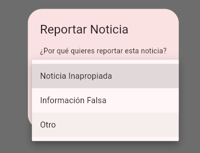

# Modelo Reporte con Configuración dart_mappable

El código muestra la implementación de un modelo de datos `Reporte` utilizando la biblioteca `dart_mappable` para manejar la serialización/deserialización automática. Sus componentes principales son:

## Estructura

- **Importación**: Incluye la biblioteca `dart_mappable` para la serialización automática
- **Part**: Declara `reporte.mapper.dart` como parte generada del código
- **Enum MotivoReporte**: Enumera las razones posibles para un reporte
  - Anotado con `@MappableEnum()` para permitir su serialización
  - Valores: `noticiaInapropiada`, `informacionFalsa`, `otro`

## Clase Reporte

- **Anotación**: `@MappableClass()` marca la clase para generación de código
- **Mixin**: `ReporteMappable` (generado automáticamente) proporciona la funcionalidad de mapeo
- **Propiedades**:
  - `id`: String opcional (puede ser nulo)
  - `noticiaId`: String requerido que identifica la noticia
  - `fecha`: String requerido para la fecha del reporte
  - `motivo`: Valor del enum `MotivoReporte`

## Constructor

Constructor con parámetros nombrados donde `id` es opcional y los demás campos son requeridos.

La configuración con `dart_mappable` permite la conversión automática entre objetos Dart y formatos como JSON sin escribir código de conversión manualmente.

## Interfaz de usuario mediante un dropdown:

## Comportamiento al Enviar un reporta
Cuando el reporte se envía correctamente:

1. El `ReportesBloc` procesa el reporte y devuelve un estado `ReporteSuccess`
2. El diálogo de reporte se cierra automáticamente
3. Aparece una notificación (Snackbar) con el mensaje: Reporte enviado correctamente
4. El usuario regresa a la vista principal de noticias

### En Caso de Error

Si ocurre un error durante el envío del reporte:

1. El `ReportesBloc` devuelve un estado `ReporteError` con un mensaje específico
2. El diálogo permanece abierto permitiendo al usuario intentar nuevamente
3. Se muestra una notificación (Snackbar) con el mensaje de error: Error al enviar el reporte
4. El usuario puede corregir cualquier problema y reintentar el envío
