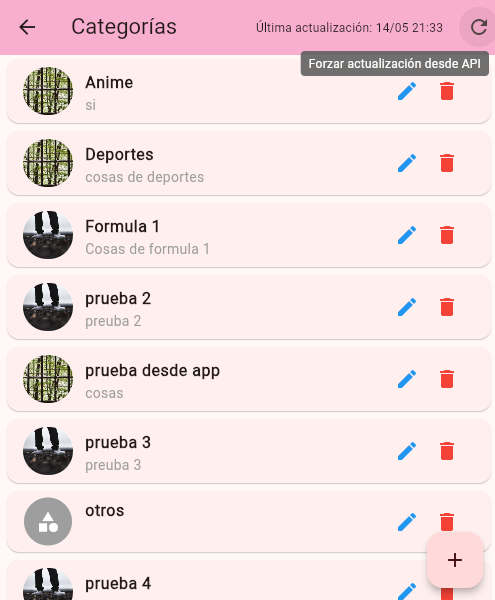

# Implementación del Servicio de Cache de Categorías

## Descripción General
Se ha implementado un servicio singleton para cachear las categorías de la aplicación y reducir el número de llamadas a la API. Este servicio permite una mejor experiencia de usuario y rendimiento al minimizar las solicitudes de red.

## Estructura de Archivos Implementados
- `lib/services/category_cache_service.dart` - Implementación principal del servicio singleton
- `lib/helpers/category_helper.dart` - Clase auxiliar para facilitar el uso del servicio de caché
- `lib/services/category_cache_service_docs.md` - Documentación detallada del servicio

## Características Principales
- **Patrón Singleton**: Asegura una única instancia del servicio en toda la aplicación
- **Caché Local**: Almacena las categorías en memoria para evitar llamadas API repetitivas
- **Forzar Actualización**: Permite refrescar los datos cuando se necesite
- **Integración con DI**: Registrado en el sistema de inyección de dependencias

## Uso del Servicio

### Obtener Categorías
```dart
// Usando el helper
List<Categoria> categorias = await CategoryHelper.getCategories();

// Usando directamente el servicio
final categoryService = di<CategoryCacheService>();
List<Categoria> categorias = await categoryService.getCategories();
```

### Refrescar Categorías
```dart
// Usando el helper
await CategoryHelper.refreshCategories();

// Usando directamente el servicio
final categoryService = di<CategoryCacheService>();
await categoryService.refreshCategories();
```

### Obtener una Categoría por ID
```dart
// Usando el helper
Categoria? categoria = await CategoryHelper.getCategoryById('id_categoria');
```

## Integración con BLoC
El servicio se ha integrado con `CategoriaBloc` para permitir el uso de caché en las pantallas existentes. El bloque ahora:

- Usa la caché para mostrar categorías inicialmente
- Refresca la caché después de operaciones CRUD
- Optimiza el rendimiento al evitar múltiples llamadas API

## Ejemplo de Implementación
Se ha actualizado `NoticiaCard` para usar el nuevo sistema de caché en lugar de llamadas directas a `CategoriaService`.

```dart
// Implementación anterior
Future<String> _obtenerNombreCategoria(String categoriaId) async {
  try {
    final categoria = await _categoriaService.obtenerCategoriaPorId(categoriaId);
    return categoria.nombre;
  } catch (e) {
    return 'Sin categoría';
  }
}

// Nueva implementación
Future<String> _obtenerNombreCategoria(String categoriaId) async {
  return await CategoryHelper.getCategoryName(categoriaId);
}
```

## Beneficios
1. **Mejor Rendimiento**: Reduce la cantidad de llamadas a la API
2. **Experiencia de Usuario Mejorada**: Tiempos de carga más rápidos al utilizar datos en caché
3. **Mantenibilidad**: Centraliza la lógica de gestión de categorías
4. **Consistencia**: Asegura que todos los componentes usan la misma fuente de datos
5. **Robustez**: Manejo adecuado de errores y estados de carga

## Screenshot

