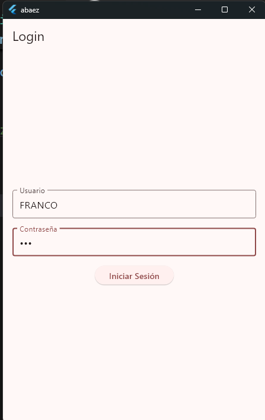
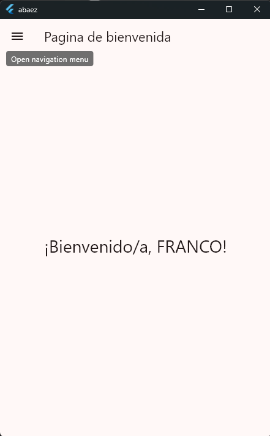
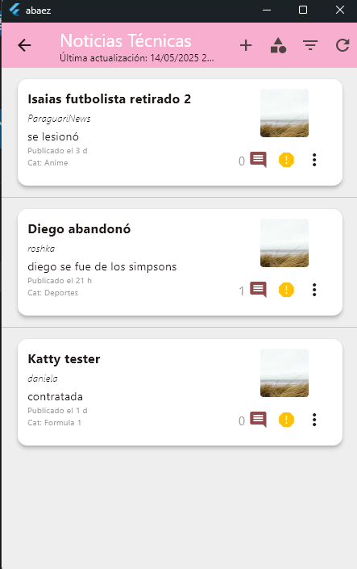
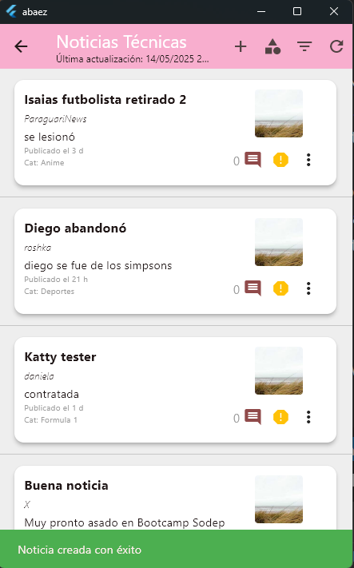
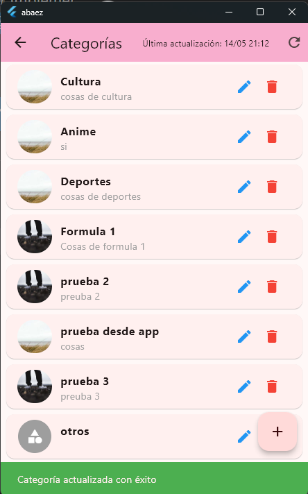
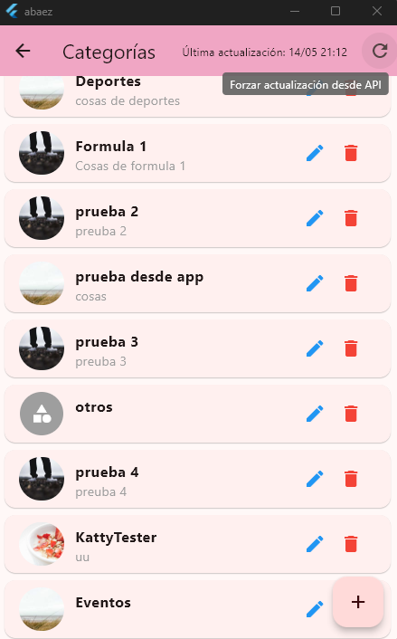
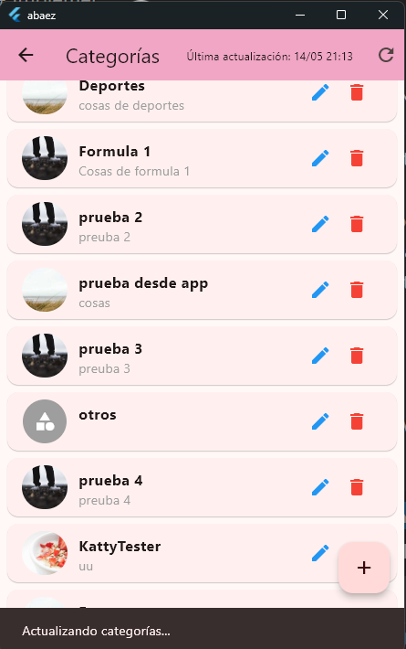
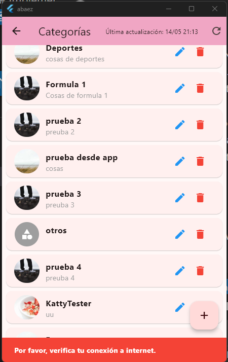

# Implementaciones del Día de la Independencia

## Qué implementamos

### 1. Autorización opcional del X-Auth-Token en métodos PUT, POST, DELETE

Implementamos un sistema de autorización flexible que permite que el token de autenticación (X-Auth-Token) sea opcional en ciertos métodos HTTP como PUT, POST y DELETE. Esto facilita:

- Mayor flexibilidad en las peticiones a la API
- Posibilidad de tener endpoints públicos y privados usando la misma estructura
- Mejor manejo de sesiones de usuario, permitiendo que algunas operaciones no requieran autenticación

La implementación permite que los servicios decidan cuándo es necesario incluir el token de autenticación en las peticiones, haciendo más versátil la interacción con el backend.

### 2. Un BaseService utilizado por todos los servicios

Desarrollamos un servicio base (BaseService) que sirve como fundamento para todos los demás servicios de la aplicación:

- Implementa lógica común para todas las peticiones HTTP
- Centraliza la gestión de errores y excepciones
- Estandariza el formato de las peticiones y respuestas
- Facilita el mantenimiento al tener un único punto para modificaciones globales

Este patrón de diseño nos permite reducir la duplicación de código y mantener una coherencia en todas las llamadas a servicios, mejorando la mantenibilidad de la aplicación.

### 3. Dependencia para comprobar la conexión a internet (ConnectivityService)

Agregamos el sistema ConnectivityService que:

- Monitoriza el estado de la conexión a internet en tiempo real
- Notifica a la aplicación cuando hay cambios en la conectividad
- Permite realizar comprobaciones previas antes de hacer peticiones a la API
- Mejora la experiencia de usuario informando sobre problemas de conectividad

Esta implementación está integrada con el sistema de BLoC para mantener un estado global de conectividad que puede ser consultado desde cualquier parte de la aplicación.

## Cómo resolvimos los problemas

Nos organizamos dividiendo las tareas en pruebas específicas:

1. **Isaias**: Autorización opcional del X-Auth-Token en métodos PUT, POST, DELETE
   - Desarrollo de la estructura de autorización

2. **katty**: BaseService como base para todos los servicios
   - Implementación del ConnectivityService

3. **Alejandra Franco**:
     Acompañamiento, investigacion, documentacion y realización de pruebas

## CAPTURAS

